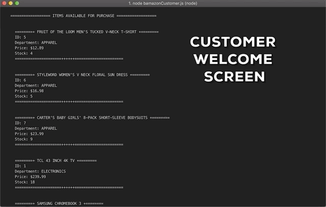
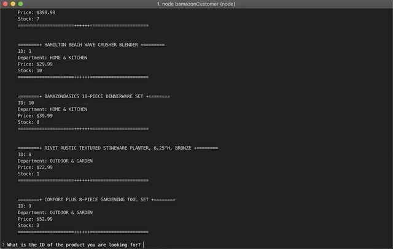
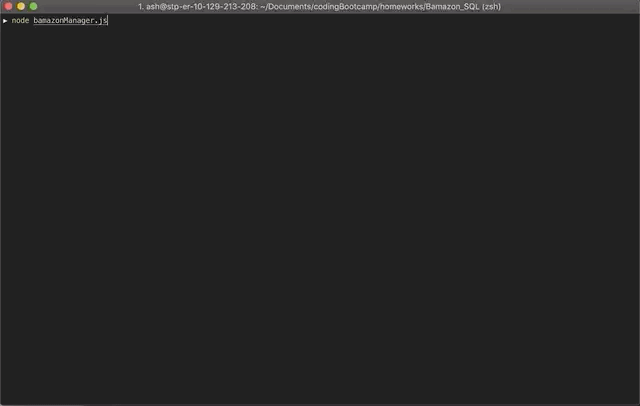
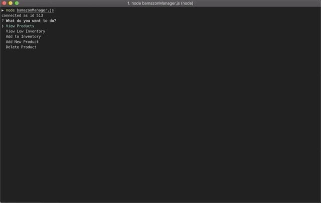

# SQL BAMAZON DB

## Overview :fire: :fire: :fire:

* Bamazon is a storefront CLI application utilizing SQL that is based on Amazon©.

* Bamazon comes with three views, Customer, Manager and Supervisor.

* The customer view allows customers to view products that are available, select a product, the quantity they want and allow the user to "purchase" it.

* The Manager view gives a unqiue set of commands to store managers for viewing and updating inventory.

* ***NOT YET IMPLEMENTED*** The supervisor view The supervisor View will allow supervisors to view product sales and profits.

* When a product is purchased, the order will "process" and remove the quantity bought form the storefront database.

* All customer and manager input is logged in log files.

***

### INSTALLATIONS

Bamazon is built with the following extensions/programs:

* [Node.js](https://nodejs.org/en/)
* [Mysql.js](https://www.npmjs.com/package/mysql)
* [Inquirer](https://www.npmjs.com/package/inquirer)
* [MAMP](https://MAMP.info/en/downloads/)
* [MySQLWorkbench](https://dev.mysql.com/downloads/workbench/)
* [Node-Native-FS](https://nodejs.org/api/fs.html)

***

### Bamazon Command Demos

***

1. `node bamazonCustomer`

    * This command will display the **Customer View**. The customer view prompts the user for inventory and quantity.

        

    * The customer will then enter an ID and the amount to purchase.

        

    * The customer is prompted to continue purchasing, or end their purchase.

        

    * If the product stock is insufficient, the purchase will not go through.

        

***
***

2. `node bamazonManager`

    * This command will display the **Manager View**. The manager view allows managers of the store to select managerial commands.

    * When first prompted, `node bamazonManager` will show the manager the following screen:

        

        * View Products

            * View products will allow the manager to see all the inventory for the store.

                